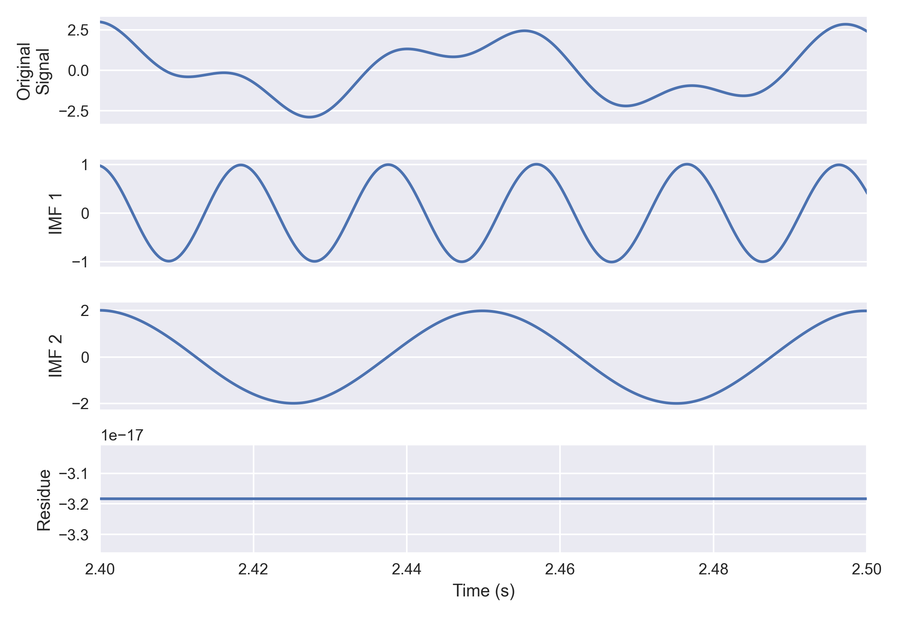
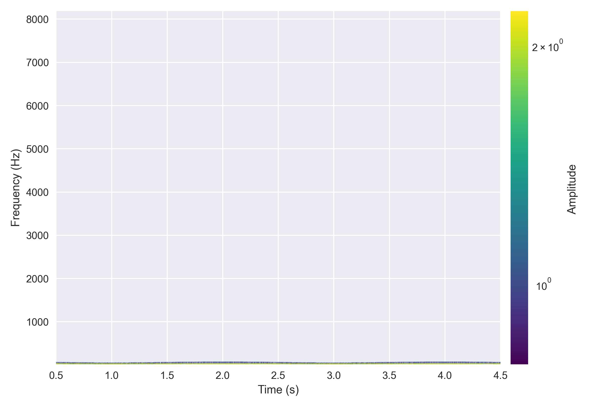
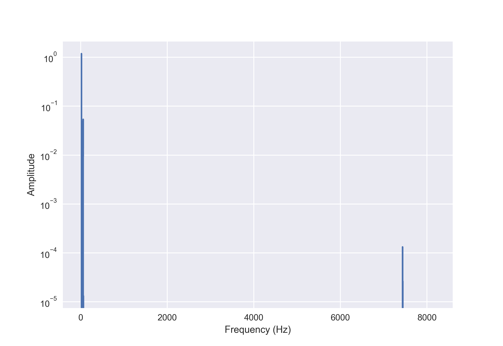
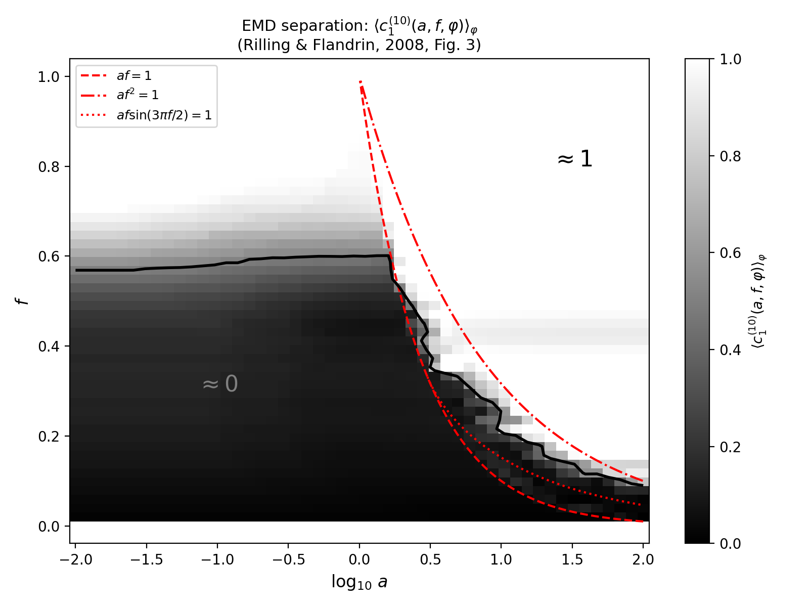

# hhtpy

A Python implementation of the Hilbert-Huang Transform (HHT), including Empirical Mode Decomposition (EMD), instantaneous frequency estimation, and Hilbert spectral analysis for nonlinear and non-stationary time series.

This library was written by **Lars Havstad** and **Geir Kulia**.

## Quick Start

```python
import numpy as np
from hhtpy import hilbert_huang_transform
from hhtpy.plot import plot_imfs, plot_hilbert_spectrum, plot_marginal_hilbert_spectrum

T = 5  # sec
f_s = 15000  # Hz
t = np.arange(T * f_s) / f_s

y = np.cos(2 * np.pi * 50 * t + 20 * np.sin(2 * np.pi * 0.5 * t)) + 2 * np.cos(
    2 * np.pi * 20 * t
)

imfs, residue = hilbert_huang_transform(y, f_s)
```

### Using Different Decomposition Methods

By default, `hilbert_huang_transform` uses standard EMD. To use EEMD, CEEMDAN, or masked EMD instead, pass a `decompose_fn`:

```python
from functools import partial
from hhtpy import hilbert_huang_transform, eemd, ceemdan, adaptive_masked_decompose

# EEMD (parallel, 100 trials)
imfs, residue = hilbert_huang_transform(
    y, f_s, decompose_fn=partial(eemd, num_trials=100, seed=42, n_jobs=-1)
)

# CEEMDAN (exact reconstruction)
imfs, residue = hilbert_huang_transform(
    y, f_s, decompose_fn=partial(ceemdan, num_trials=100, seed=42)
)

# Adaptive masked EMD
imfs, residue = hilbert_huang_transform(
    y, f_s, decompose_fn=partial(adaptive_masked_decompose, sampling_frequency=f_s)
)
```

Any function that takes `signal` as its first argument and returns `(imfs, residue)` works.

## Plotting

### IMFs

```python
fig, axs = plot_imfs(imfs, y, residue, t, max_number_of_imfs=2)
```



### Hilbert Spectrum

```python
from hhtpy.plot import HilbertSpectrumConfig

fig, ax, clb = plot_hilbert_spectrum(
    imfs,
    config=HilbertSpectrumConfig(max_number_of_imfs=2),
)
```



### Marginal Hilbert Spectrum

```python
fig, ax = plot_marginal_hilbert_spectrum(imfs)
```



## EMD Decomposition

The `decompose()` function extracts Intrinsic Mode Functions (IMFs) from a signal using the sifting process.

```python
from hhtpy import decompose

imfs, residue = decompose(signal)

# Reconstruction is always exact:
# np.sum(imfs, axis=0) + residue == signal
```

### Parameters

```python
from hhtpy import EnvelopeOptions

imfs, residue = decompose(
    signal,                   # 1D numpy array
    stopping_criterion=...,   # Controls when sifting stops (see below)
    max_imfs=None,            # Limit number of IMFs (None = automatic)
    max_sifts=100,            # Safety limit per IMF to prevent non-convergence
    envelope_opts=EnvelopeOptions(
        spline_method="cubic",    # "cubic", "pchip", or "akima"
        boundary_mode="linear",   # "linear", "mirror", or "none"
    ),
)
```

- **max_imfs**: Set this to extract only the first N IMFs. Useful when you know
  how many components your signal has, or for faster computation.
- **max_sifts**: Safety valve that stops sifting after 100 iterations even if the
  stopping criterion hasn't been met. Only relevant for adaptive criteria.
- **envelope_opts**: Controls how envelopes are interpolated during sifting.
  - `spline_method`: `"cubic"` (default), `"pchip"` (monotone, no overshoot), or `"akima"` (smooth, reduced overshoot).
  - `boundary_mode`: `"linear"` (default, extrapolate from nearest extrema), `"mirror"` (reflect extrema at boundaries), or `"none"` (use endpoint values directly).

## Stopping Criteria

The sifting process needs a rule to decide when an IMF is "good enough". hhtpy provides four built-in criteria. All are passed to `decompose()` via the `stopping_criterion` parameter.

### Fixed Number of Sifts (Default)

The simplest approach: sift exactly N times. Huang (2015) recommended 10-15 sifts as a practical default.

```python
from hhtpy import get_stopping_criterion_fixed_number_of_sifts

# Default in decompose() is 15 sifts
criterion = get_stopping_criterion_fixed_number_of_sifts(10)
imfs, residue = decompose(signal, stopping_criterion=criterion)
```

### S-Number (Huang et al., 2003)

Counts consecutive sifts where the number of extrema and zero-crossings stays the same. Stops when this count reaches S. This detects when the sifting has converged in terms of the signal's oscillatory structure.

```python
from hhtpy import get_stopping_criterion_s_number

criterion = get_stopping_criterion_s_number(s_number=5)
imfs, residue = decompose(signal, stopping_criterion=criterion)
```

### Cauchy Convergence

Stops when the relative energy change between consecutive sifts falls below a threshold. Measures how much the sifting is still modifying the signal.

```python
from hhtpy import get_stopping_criterion_cauchy

criterion = get_stopping_criterion_cauchy(threshold=0.3)
imfs, residue = decompose(signal, stopping_criterion=criterion)
```

### Rilling–Flandrin–Gonçalves (2003)

Evaluates IMF quality by comparing the mean envelope to the amplitude envelope at each sample. Unlike Cauchy (which measures convergence rate), this directly measures whether the current mode satisfies the IMF property of having a near-zero mean envelope.

Two conditions must both be met:
1. At most `alpha` fraction of samples have `|mean_envelope| / amplitude > threshold_1`
2. No sample has `|mean_envelope| / amplitude > threshold_2`

```python
from hhtpy import get_stopping_criterion_rilling

# Default parameters from the original paper
criterion = get_stopping_criterion_rilling(
    threshold_1=0.05,   # 5% tolerance for most samples
    threshold_2=0.5,    # 50% hard ceiling for any sample
    alpha=0.05,         # Allow 5% of samples to exceed threshold_1
)
imfs, residue = decompose(signal, stopping_criterion=criterion)
```

### Custom Stopping Criterion

Any function matching the signature `(mode: np.ndarray, total_sifts_performed: int) -> bool` works:

```python
def my_criterion(mode, total_sifts_performed):
    if total_sifts_performed == 0:
        return False  # Always do at least one sift
    # Your logic here
    return total_sifts_performed >= 20

imfs, residue = decompose(signal, stopping_criterion=my_criterion)
```

## Instantaneous Frequency Methods

After decomposition, hhtpy computes instantaneous frequency and amplitude for each IMF. Seven methods are available, all passed via the `frequency_calculation_method` parameter:

### Quadrature Method (Default)

The direct quadrature method normalizes the IMF and computes the analytic signal as `z(t) = x(t) + i·q(t)` where `q(t) = sign(dx/dt) · sqrt(1 - x²)`. This avoids limitations of the Hilbert transform (Bedrosian theorem) for wideband signals.

```python
from hhtpy import hilbert_huang_transform

imfs, residue = hilbert_huang_transform(signal, sampling_frequency)
# Each IMF object has: .signal, .instantaneous_frequency, .instantaneous_amplitude
```

### Hilbert Transform

The standard approach using `scipy.signal.hilbert` to compute the analytic signal, then deriving instantaneous frequency from the unwrapped phase gradient.

```python
from hhtpy import hilbert_huang_transform, calculate_instantaneous_frequency_hilbert

imfs, residue = hilbert_huang_transform(
    signal,
    sampling_frequency,
    frequency_calculation_method=calculate_instantaneous_frequency_hilbert,
)
```

### Additional Methods

All methods follow the same `(imf, sampling_frequency) -> frequency` signature:

| Method | Function | Description |
|--------|----------|-------------|
| Zero-crossing | `calculate_instantaneous_frequency_zero_crossing` | Half-period zero-crossing intervals. Simple, no normalization needed. |
| GZC | `calculate_instantaneous_frequency_generalized_zero_crossing` | Huang et al. (2009). Averages 4 period types at each reference point. Most robust for noisy signals. |
| TEO | `calculate_instantaneous_frequency_teo` | Teager Energy Operator. Extremely local (3 samples). Responsive to rapid changes but noise-sensitive. |
| Hou | `calculate_instantaneous_frequency_hou` | Arccos method. No normalization needed. Works well with slowly-varying amplitude. |
| Wu | `calculate_instantaneous_frequency_wu` | Quadrature-based derivative ratio. Requires normalized IMF. |

```python
from hhtpy import (
    hilbert_huang_transform,
    calculate_instantaneous_frequency_generalized_zero_crossing,
)

imfs, residue = hilbert_huang_transform(
    signal,
    sampling_frequency,
    frequency_calculation_method=calculate_instantaneous_frequency_generalized_zero_crossing,
)
```

### Frequency Despiking

The quadrature method can produce spikes at IMF extrema. `despike_frequency` removes them by interpolation:

```python
from hhtpy import despike_frequency

clean_freq = despike_frequency(imf_obj.instantaneous_frequency, imf_obj.signal)
```

## Quality Diagnostics

### Index of Orthogonality

Measures how orthogonal the extracted IMFs are to each other. A good decomposition produces nearly orthogonal IMFs (IO close to 0). High values suggest mode mixing or energy leakage between IMFs.

```python
from hhtpy import decompose, index_of_orthogonality

imfs, residue = decompose(signal)
io = index_of_orthogonality(imfs)
print(f"Index of orthogonality: {io:.4f}")  # Lower is better
```

### Statistical Significance Test (Wu & Huang, 2004)

Tests whether each IMF contains statistically significant information beyond white noise. EMD applied to white noise behaves as a dyadic filter bank where energy × period is constant. IMFs with energy outside the expected confidence interval are flagged as significant.

```python
from hhtpy import decompose, significance_test

imfs, residue = decompose(signal)
results = significance_test(imfs, alpha=0.95)

for r in results:
    status = "signal" if r.is_significant else "noise"
    print(f"IMF {r.index}: {status} (log_energy={r.log_energy:.2f})")
```

Two test variants: `"aposteriori"` (default, uses first IMF as noise reference) and `"apriori"` (two-sided test against theoretical white noise line).

## Ensemble EMD (EEMD)

Standard EMD can suffer from *mode mixing* — when oscillatory components of different scales end up in the same IMF. EEMD (Wu & Huang, 2009) mitigates this by adding white Gaussian noise over multiple trials and averaging the resulting IMFs. The noise populates the time-frequency space uniformly, guiding the sifting process to separate scales consistently.

```python
from hhtpy import eemd

imfs, residue = eemd(
    signal,
    num_trials=100,        # Number of noise-perturbed decompositions
    noise_amplitude=0.2,   # Noise std as fraction of signal std (20%)
    seed=42,               # For reproducibility
    n_jobs=-1,             # Parallel: -1 = all cores, None = serial
)
```

**Note:** EEMD does not guarantee exact reconstruction. The residual noise decreases as `noise_amplitude / sqrt(num_trials)` but never reaches zero. For exact reconstruction, use CEEMDAN.

## CEEMDAN

Complete Ensemble EMD with Adaptive Noise (Torres et al., 2011) improves on EEMD in two ways:

1. **Exact reconstruction** — `sum(imfs) + residue == signal` is guaranteed by construction.
2. **Adaptive noise** — noise is added at each decomposition stage (not just to the original signal), keeping the signal-to-noise ratio constant across all stages.

At each stage *k*, the noise contribution is the *k*-th IMF of the original noise realization, scaled to the current residue's standard deviation.

```python
from hhtpy import ceemdan

imfs, residue = ceemdan(
    signal,
    num_trials=100,        # Number of ensemble trials
    noise_amplitude=0.2,   # Noise scale factor (fraction of residue std)
    seed=42,               # For reproducibility
    n_jobs=-1,             # Parallel: -1 = all cores, None = serial
)

# Exact reconstruction is guaranteed:
# np.sum(imfs, axis=0) + residue == signal
```

See `example_eemd.py` for a side-by-side comparison of EMD, EEMD, and CEEMDAN on a signal with intermittent high-frequency bursts.

## Multivariate EMD (MEMD)

Multivariate EMD (Rehman & Mandic, 2010) extends EMD to multi-channel signals. It computes envelopes by projecting the signal onto uniformly distributed direction vectors on the unit hypersphere (generated via the Hammersley quasi-random sequence), then averages the back-projected mean envelopes.

The key advantage over applying standard EMD to each channel independently: MEMD **aligns** common oscillatory scales across all channels, ensuring shared modes appear at the same IMF index.

```python
from hhtpy import memd

# signal shape: (n_channels, n_samples)
signal = np.array([ch1, ch2, ch3])

imfs, residue = memd(
    signal,
    num_directions=64,     # Direction vectors on the unit hypersphere
    max_imfs=None,         # None = automatic
    max_sifts=100,         # Safety limit per IMF
    stop_threshold=0.075,  # Normalized mean envelope threshold
)

# imfs shape: (n_imfs, n_channels, n_samples)
# Exact reconstruction: np.sum(imfs, axis=0) + residue == signal
```

- **num_directions** must be >= 2 × n_channels. Higher values give better envelope estimates at the cost of computation. Default is 64.
- The input shape is `(n_channels, n_samples)` — channels first.

See `example_memd.py` for a complete example with a two-channel signal.

## Masked EMD

Masked EMD mitigates mode mixing by adding a known sinusoidal mask to the signal before sifting, then averaging results from multiple phase-shifted masks to cancel the mask contribution. This forces scale separation according to the mask frequency rather than relying on the signal's own structure.

### Explicit Mask Parameters

```python
from hhtpy import masked_decompose

imfs, residue = masked_decompose(
    signal,
    mask_frequency=50.0,       # Base mask frequency in Hz
    mask_amplitude=2.0,        # Mask amplitude (absolute)
    sampling_frequency=1000,
    num_phase_shifts=8,        # Phase shifts to average over
)
```

The mask frequency halves for each successive IMF: `f_j = mask_frequency / 2^j`.

### Adaptive Mask Parameters

Automatically estimates the mask frequency and amplitude from the signal:

```python
from hhtpy import adaptive_masked_decompose

imfs, residue = adaptive_masked_decompose(
    signal,
    sampling_frequency=1000,
)
```

Three initialization strategies are available:

| Strategy | Function | Description |
|----------|----------|-------------|
| Huang (default) | `mask_init_huang` | `f_0 = max(zero-crossing freq)`, `a_0 = mean(amplitude)`. Simple and general. |
| Deering–Kaiser | `mask_init_deering_kaiser` | Amplitude-weighted frequency centroid. Good for well-separated tones. |
| Spectral | `mask_init_spectral` | DFT peak frequency. Robust for broadband signals. |

```python
from hhtpy import adaptive_masked_decompose, mask_init_spectral

imfs, residue = adaptive_masked_decompose(
    signal,
    sampling_frequency=1000,
    mask_init_method=mask_init_spectral,
)
```

## Mode Mixing / Separation Analysis

EMD can suffer from *mode mixing* — when two frequency components end up in the same IMF instead of being separated. Whether the EMD resolves two tones or treats them as a single modulated component depends on their amplitude and frequency ratios, as analyzed by [Rilling & Flandrin (2008)](https://doi.org/10.1109/TSP.2007.906771).

The plot below maps the separation boundary: dark regions indicate successful separation, light regions indicate mode mixing.



See `emd_separation_analysis.py` to reproduce this analysis.

## API Reference

### Core Functions

| Function | Description |
|----------|-------------|
| `decompose(signal, ...)` | EMD decomposition into IMFs + residue |
| `hilbert_huang_transform(signal, fs, ...)` | Full HHT: decompose + instantaneous frequency/amplitude |
| `marginal_hilbert_spectrum(imfs)` | Frequency-domain amplitude integration |
| `index_of_orthogonality(imfs)` | Decomposition quality metric |
| `eemd(signal, ...)` | Ensemble EMD — noise-assisted decomposition |
| `ceemdan(signal, ...)` | Complete EEMD with Adaptive Noise |
| `memd(signal, ...)` | Multivariate EMD for multi-channel signals |
| `masked_decompose(signal, ...)` | Masked EMD with explicit mask parameters |
| `adaptive_masked_decompose(signal, ...)` | Masked EMD with automatic parameter estimation |
| `despike_frequency(frequency, imf)` | Remove quadrature-induced frequency spikes |
| `significance_test(imfs, ...)` | Wu-Huang statistical significance test for IMFs |

### Configuration

| Class | Description |
|-------|-------------|
| `EnvelopeOptions(spline_method, boundary_mode)` | Configure spline interpolation and boundary handling |

### Stopping Criteria

| Function | Description |
|----------|-------------|
| `get_stopping_criterion_fixed_number_of_sifts(n)` | Stop after exactly n sifts |
| `get_stopping_criterion_s_number(s)` | Stop when extrema/zero-crossings stabilize |
| `get_stopping_criterion_cauchy(threshold)` | Stop when energy change is small |
| `get_stopping_criterion_rilling(t1, t2, alpha)` | Stop when envelope symmetry is good |

### Frequency Methods

| Function | Description |
|----------|-------------|
| `calculate_instantaneous_frequency_quadrature` | Direct quadrature (default) |
| `calculate_instantaneous_frequency_hilbert` | Via scipy Hilbert transform |
| `calculate_instantaneous_frequency_zero_crossing` | Half-period zero-crossing intervals |
| `calculate_instantaneous_frequency_generalized_zero_crossing` | GZC — averages 4 period types (Huang 2009) |
| `calculate_instantaneous_frequency_teo` | Teager Energy Operator (3-sample) |
| `calculate_instantaneous_frequency_hou` | Arccos method, no normalization needed |
| `calculate_instantaneous_frequency_wu` | Quadrature-based derivative ratio |

### Mask Initialization

| Function | Description |
|----------|-------------|
| `mask_init_huang` | Max zero-crossing frequency + mean amplitude |
| `mask_init_deering_kaiser` | Amplitude-weighted frequency centroid |
| `mask_init_spectral` | DFT peak frequency + spectral amplitude |

### Plotting

| Function | Description |
|----------|-------------|
| `plot_imfs(imfs, signal, residue, x_axis)` | Time-domain IMF subplots |
| `plot_hilbert_spectrum(imfs, config)` | Time-frequency Hilbert spectrum |
| `plot_hilbert_spectrum_contour(imfs, ...)` | Contour-style time-frequency spectrum |
| `plot_marginal_hilbert_spectrum(imfs)` | Frequency-domain marginal spectrum |

## Acknowledgements

We want to express our sincere gratitude to the following individuals for their invaluable contributions and support throughout this project:

- **Professor Norden Huang**: For his extensive one-on-one lectures over ten days, during which he taught us the Hilbert-Huang Transform (HHT) and guided us through the nuances of implementing it. Many of the insights and implementation techniques used in this project directly result from these invaluable sessions.

- **Professor Marta Molinas**: To introduce us to the HHT methodology, provide foundational knowledge, and engage in valuable discussions about the implementation. Her guidance has been instrumental in shaping our understanding and approach.

- **Professor Olav B. Fosso**: For his numerous fruitful dialogues on improving and optimizing the algorithm. His insights have greatly influenced the refinement of our implementation.

- **Sumit Kumar Ram (@sumitram)**: For explaining the HHT algorithm to me for the first time. His clear and concise explanation provided the initial spark that fueled our deeper exploration of the method.

Thank you all for your expertise, time, and mentorship, which made this work possible.

## Contributing

Contributions are welcome! If you have suggestions for improvements or find any issues, please open an issue or submit a pull request on the GitHub repository.
